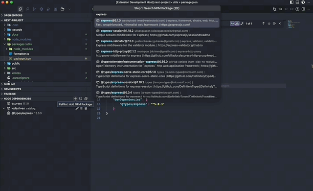

# Node Dependencies - Advanced NPM Package Manager for VS Code

Node Dependencies is a powerful VS Code extension that provides comprehensive npm package management capabilities with advanced visualization and monorepo support. It offers graphical dependency visualization, intelligent package management, and seamless monorepo integration.

## Features

### 🎨 Graphical Dependency Visualization

-   **Hierarchical Dependency Tree**: Visualize npm package dependencies in an intuitive tree structure
-   **Icon-Based Type Distinction**: Different icons to distinguish between dependencies, devDependencies, and peerDependencies
-   **Interactive Hover Information**: Hover over packages to view detailed information including version, description, and status

### 📦 Intelligent Package Management

-   **Visual Package Operations**: Add, remove, and open packages through an intuitive graphical interface
-   **Automatic Type File Updates**: Automatically append and update TypeScript declaration files when managing packages
-   **Smart Package Detection**: Intelligent detection of package types and automatic categorization

### 🏗️ Monorepo Support

-   **Automatic Workspace Detection**: Automatically identifies and maps monorepo package dependencies
-   **Context-Aware Dependency Graphs**: Shows relevant dependencies based on currently opened files
-   **Multi-Package Management**: Manage dependencies across multiple packages in a monorepo
-   **Workspace-Aware Navigation**: Navigate between different packages and their dependencies seamlessly

### 📋 Dependencies View

The main interface shows your project's dependencies organized in a clean tree structure within the Package Explorer panel:

## Usage

### Getting Started

1. Open a project with a `package.json` file (or a monorepo workspace)
2. Look for the "Node Dependencies" icon in the Activity Bar
3. Click to expand and view your project's npm dependencies with graphical visualization
4. Hover over packages to see detailed information
5. Use context menus for package management operations

### Monorepo Support

1. Open a monorepo workspace with multiple `package.json` files
2. The extension automatically detects the workspace structure
3. Navigate between different packages using the workspace-aware interface
4. View context-specific dependencies based on your currently opened files

### Available Commands

#### Available Commands (via Command Palette)

-   **Node Dependencies: Add NPM Package**: Add a new package to your project with visual interface

## Installation

### From VS Code Marketplace

1. Open VS Code
2. Go to Extensions (Ctrl+Shift+X)
3. Search for "Node Dependencies"
4. Click Install

### From Source

1. Clone this repository
2. Run `npm install`
3. Run `npm run compile`
4. Press F5 to launch in Extension Development Host

## Requirements

-   VS Code 1.99.0 or higher
-   Node.js project with package.json
-   For monorepo support: Workspace with multiple package.json files
-   TypeScript projects supported for automatic type file management

## Contributing

Contributions are welcome! Please feel free to submit a Pull Request.

## License

This project is licensed under the Apache License 2.0.

## Support

For issues and feature requests, please visit the [GitHub repository](https://github.com/rosendolu/FePilot).
